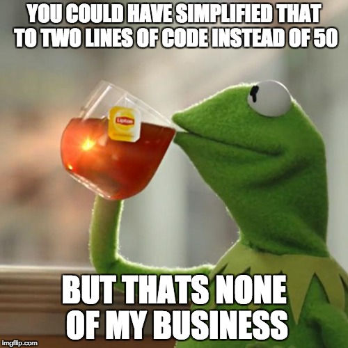

# Security Homework 2
# Master README
NOTE: this project uses UNIX libraries and as such should(can) only be run on UNIX computers.

## Compilation
make was last tested on my mac and compiled every example successfully. The command 'make' will make everything, in order to compile certain objectives use the command 'make c#' where 0<= # <=10. Local makefiles for each objective are also included.

## Folder Guide
* C0 - Domain Separation
* C1 - Process Isolation
* C2 - Resource Encapsulation
* C3 - Least Privilege
* C4 - Modularity
* C5 - Layering
* C6 - Abstraction
* C7 - Data Hiding
* C8 - Simplicity
* C9 - Minimization

### Implemented in HW2P1
* C2 - Resource Encapsulation
* C4 - Modularity
* C5 - Layering
* C6 - Abstraction
* C7 - Data Hiding
* C8 - Simplicity
p1-1 = C7,C4 - HiddenData class
p1-2 = c2,c6 - use hiddenData in person class, person class in crowd class
p1-3 = c8 - inline assembly
p1-4 = C5 - make security wrapper for crowd class

### Implemented in HW2P2
* C0 - Domain Separation
* C1 - Process Isolation
* C3 - Least Privilege
* C9 - Minimization
p2-1 = c1, c0 - process shared memory
p2-2 = C9 - minimal network prog
p2-3 = C3 - capability levels

## C0 - Domain Separation
p2-1 demonstrates domain separation by prohibiting other processes(the other domains) from accessing shared memory between a child and parent process. This separation prevents other processes from affecting the shared memory. The bad example demonstrates a bad way to utilize shared memory by creating a shared memory block for the child and parent processes, but this memory is also available from the rest of the system so other processes could have an effect on the shared memory and potentially cause problems.


*good.cpp*
```
...
int protection = PROT_READ;

// The buffer will be shared (meaning other processes can access it), but
// anonymous (meaning third-party processes cannot obtain an address for it),
// so only this process and its children will be able to use it:
int visibility = MAP_ANONYMOUS | MAP_SHARED;

return mmap(NULL, size, protection, visibility, 0, 0);
...
```

*bad.c*
```
...
/* open the shared memory segment as if it was a file */
shm_fd = shm_open(name2, O_RDONLY, 0666);
...

/* map the shared memory segment to the address space of the process */
shm_base = mmap(0, SIZE, PROT_READ, MAP_SHARED, shm_fd, 0);
...
```

## C1 - Process Isolation
p2-1 demonstrates process isolation through the use of shared memory between processes. The good example successfully demonstrates a method whereby, in order to share information between a parent and child process, the program maps a segment of memory using mmap() and sets appropriate permissions so that other processes can ACCESS the memory, but they wont know the address of the memory space so other processes cannot edit that memory. The bad example demonstrates using shm_open in order to create a shared memory segment using and improper amount of permissions. These permissions thus enable a separate process(here we use evil.c) to read and overwrite that shared memory process. If done at the opportune time, then the child process will only read the intercepted message written by evil.c and not the intended message written by the parent process.


*good.cpp*
```
...
int protection = PROT_READ;

// The buffer will be shared (meaning other processes can access it), but
// anonymous (meaning third-party processes cannot obtain an address for it),
// so only this process and its children will be able to use it:
int visibility = MAP_ANONYMOUS | MAP_SHARED;

return mmap(NULL, size, protection, visibility, 0, 0);
...
```

*bad.c*
```
...
/* open the shared memory segment as if it was a file */
shm_fd = shm_open(name2, O_RDONLY, 0666);
...

/* map the shared memory segment to the address space of the process */
shm_base = mmap(0, SIZE, PROT_READ, MAP_SHARED, shm_fd, 0);
...
```

## C2 - Resource Encapsulation
p1-2 = c6 - use hiddenData in person class, person class in crowd class
p1-2 demonstrates Resource Encapsulation by abstracting the hiddenData class into an object within the Person class, thus using the HiddenData class to allow the Person class access to only the necessary information retrieval functions.
*person.h*

```
class Person{
public:
  string _name, _job, _origin;
  int _age;
  HiddenData _extraInfo;//<<--!!
  Person();
  Person(string name,string job,string origin,int age);
};
```

## C3 - Least Privilege
p2-3 demonstrates a least privilege proof of concept. The good example demonstrates setting different levels of capabilities based on an entered password. The bad example sets the capability level as admin level no matter the password.


*good.cpp*
```
if(pass=="admin"){
  level=2;
}else{
  level=1;
}
```

*bad.cpp*
```
if(pass=="admin"||true){
  level=2;
}else{
  level=1;
}
```

## C4 - Modularity
p1-1 demonstrates modularity by allowing the future possibility of implementing a possible TCP/IP communications function inside the callNumber() function.


*hidden.cpp*
```
...
//OOPS! we accidentally revealed the phone number!
//but we can extend this to actually place a TCP/IP
//"phone call" in the future
void HiddenData::callNumber(){
  string num = to_string(phoneNum);
  cout << ">Calling " << num.at(0) << num.at(1) << num.at(2) << "-";
  cout << num.at(3) << num.at(4) << num.at(5) << num.at(6) << endl;
  for(int i=0;i<5;i++){cout<<".";sleep(2);}//
  cout << " *disconnected*" << endl;
}
...
```

## C5 - Layering
p1-4 demonstrates layering through the encapsulation of the Crowd class in a authentication class to enable a natural selection function on the Crowd. The bad example merely removes the password check to show a bad example of adding a secure layer.


*secureCrowd.h*
```
class SecureCrowd{
public:
  Crowd myCrowd;
  SecureCrowd();//constructor
  void login(string password);
  bool isLoggedIn();
  void engageNaturalSelection();

private:
  bool loggedIn;
};
```

## C6 - Abstraction
p1-2 demonstrates abstraction by using multiple classes to eliminate unnecessary details during certain stages of development. When designing each class it is possible to focus on the functionality of that particular class, while simply believing the fact that we know the classes we are building on top of will work correctly. This is the main principle behind reusing code and allows us to be certain our underlying libraries have been tested to work properly. The good example shows an example of building a Crowd class on top of a Person class which uses the HiddenData class.


*crowd.h*
```
class Crowd{
public:
  vector<Person> people;
  Crowd();
  vector<Person>* getTownies(string homeTown);
  int getSize();
};
```

The non example merely transforms the Person class and doesn't add any significant functionality.

*non.h*
```
class non{
public:
  Person newPerson();
  void setName(Person &p, string name);
  void setJob(Person &p, string job);
};
```

## C7 - Data Hiding
p1-1 demonstrates both the good and the bad ways of hiding data from a user.
This program successfully prevents a user record's Social Security and Phone Number fields from being exposed by setting them to private and only allowing access through custom modifiers. However the program also shows an unsafe example of hiding by accidentally leaking the phone number when the call_number() function is called, thus subverting the variables private status.


*hidden.cpp*
```
...
int HiddenData::getSSnum(){
  cout << ">nope you can't look at the SS# directly" << endl;
  return 0;
}
...
//preventing the user from *seeing* the full phone number
//number will still be viewable in memory
int HiddenData::getPhoneNum(){
  cout << ">this is a private field so you must use our modifier\n";
  cout << ">and we only give you the last 4 numbers\n";
  string tmpNum = to_string(phoneNum);

  tmpNum = tmpNum.substr((tmpNum.length()-4),tmpNum.length());
  return stoi(tmpNum);
}

//OOPS! we accidentally revealed the phone number!
void HiddenData::callNumber(){
  string num = to_string(phoneNum);
  cout << ">Calling " << num.at(0) << num.at(1) << num.at(2) << "-";
  cout << num.at(3) << num.at(4) << num.at(5) << num.at(6) << endl;
  for(int i=0;i<5;i++){cout<<".";sleep(2);}//
  cout << " *disconnected*" << endl;
}
```

### Good Example
*hidden.h*
```
...
class HiddenData{
private:
  ulong SSnum;
  ulong phoneNum;
...
```
*hidden.cpp*
```
...
int HiddenData::getSSnum(){
  cout << ">nope you can't look at the SS# directly" << endl;
  return 0;
}
...
int HiddenData::getPhoneNum(){
  cout << ">this is a private field so you must use our modifier\n";
  cout << ">and we only give you the last 4 numbers\n";
  string tmpNum = to_string(phoneNum);

  tmpNum = tmpNum.substr((tmpNum.length()-4),tmpNum.length());
  return stoi(tmpNum);
}
```
### Bad Example
*hidden.cpp*
```
//OOPS! we accidentally revealed the phone number!
void HiddenData::callNumber(){
  string num = to_string(phoneNum);
  cout << ">Calling " << num.at(0) << num.at(1) << num.at(2) << "-";
  cout << num.at(3) << num.at(4) << num.at(5) << num.at(6) << endl;
  for(int i=0;i<5;i++){cout<<".";sleep(2);}//
  cout << " *disconnected*" << endl;
}
```

## C8 - Simplicity
These examples show a simple way to perform an arbitrary calculation and two ways to overcomplicate that same calculation. The good way uses a simple while loop to perform the calculation, requiring only 9 lines. The bad way shows two different ways to overcomplicate this calculation. The first way uses inline assembly code to perform the while loop by jmp'ing to inline labels. The output is also encoded in hex form further obfuscating the program and decreasing readability. Inline NOP assembly instructions are also included to increase program complexity. The second bad example uses bitshifting to perform the calculation which may confuse future programmers who may need to edit the code.


*good.c*
```
int main(){
  int x =200;
  while(x>5){
    x/=2;
    printf("x=%d\n",x);
  }
}
```

*bad.c*
```
asm("AA:\nNOP");//while loop through jmping
if(*x>(int)5){
  *x=*x/2;//desired operation
  //asm("sar $1,%1":"=r"(*x):"n"(*x));//<<<---- couldnt get this working
  printf("%c%c%d%c%c%c%c%c%c%c%d\n",0x78,0x3d,x,0x20,0x2d,0x2d,0x20,0x2a,0x78,0x3d,*x);//teehee
  asm("NOP\nNOP\nNOP\nNOP\nNOP\nNOP\nNOP\nNOP\nNOP\nNOP\nNOP\nNOP\nNOP\nNOP\nNOP\nNOP\nNOP\njmp AA");
}
...
//second bad example
*x=200;
while(*x>5){
  *x>>=1;
  printf("%c%c%d%c%c%c%c%c%c%c%d\n",0x78,0x3d,x,0x20,0x2d,0x2d,0x20,0x2a,0x78,0x3d,*x);//teehee
}
```

## C9 - Minimization
p2-2 demonstrates good and bad examples of minimization, with the good example creating a minimal server with one open port while the bad example opens up 3 different ports for connection. These ports are unnecessary and one is an administration port, which should be password protected but is not.


*ex.cpp*
```
...
portno = 18000;
...
```

*non.cpp*
```
...
portno = 18001;
...
portno = 18000;
...
```
